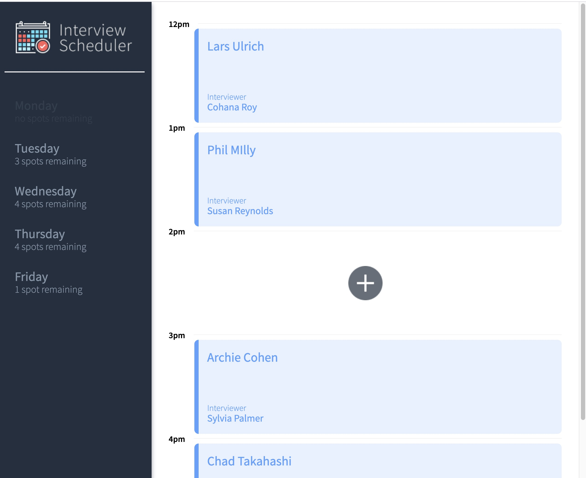
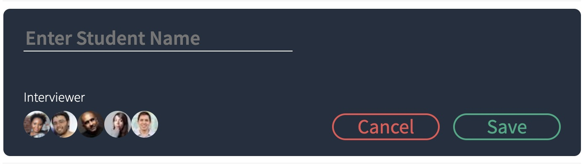
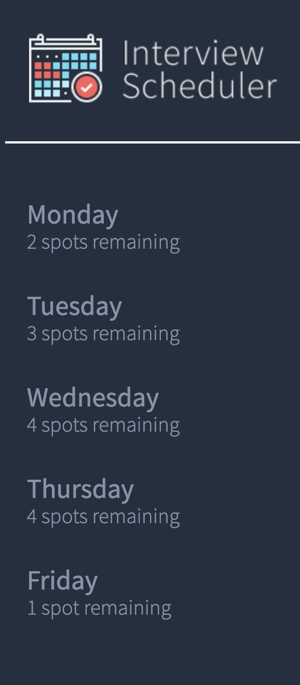

# Interview Scheduler

Welcome to Interview Scheduler! This is a super simple, easy to use app for scheduling interviews for weekly appointments.



Students can be assigned an interviewer and as appointments are saved, the weekly spots remaining are updated.





Enjoy!

## Setup

Install dependencies with `npm install`.

## Running Webpack Development Server

```sh
npm start
```

## Running Jest Test Framework

```sh
npm test
```

## Running Storybook Visual Testbed

```sh
npm run storybook
```
